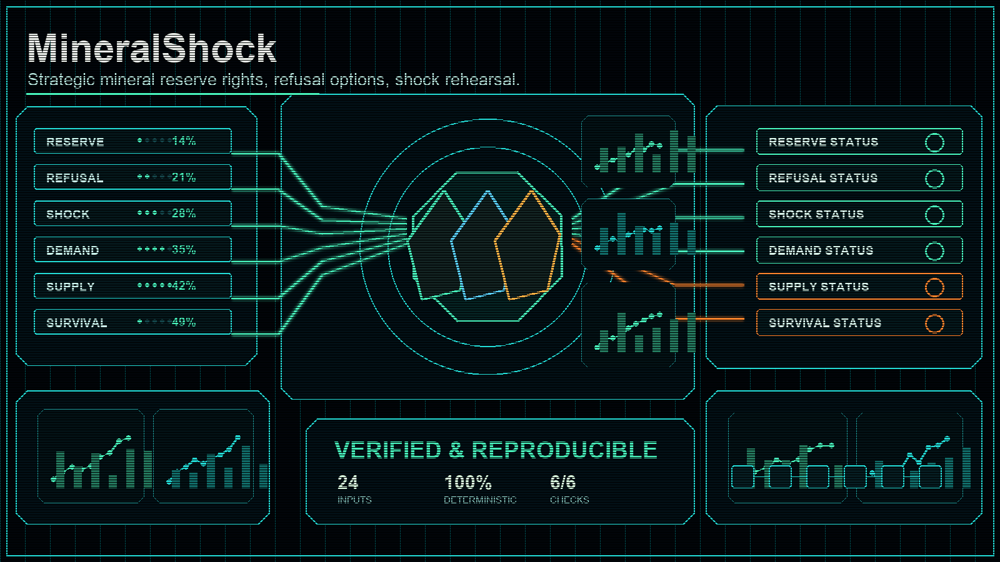

# MineralShock

> Strategic-mineral reserve market + refusal option + shock rehearsal.

## One-sentence pitch

`MineralShock` answers: *How much is the right to draw on a strategic-mineral reserve worth, what does the option to refuse a shipment cost, and how many days does the system survive when supply is disrupted and demand spikes?*

## Why this matters

Critical minerals (lithium, cobalt, rare earths) underpin energy, defense, and digital supply chains. A reserve is not just a stockpile — it is a priced right, a bargaining chip (the refusal option), and a survival clock. `MineralShock` is a stdlib-only CLI and Python package that combines three mechanisms into one deterministic model:

- **ReserveFlow** — price the right to draw on a stockpile, scaled by coverage and scarcity.
- **RefusalOption** — price the premium for the capacity to refuse a shipment under threat.
- **ShockRehearsal** — rehearse a supply shock (demand spike + supply disruption) and measure total shortfall, affected minerals, and survival days.

## What it is not

- Not a live commodities exchange.
- Not a forecasting or time-series model.
- Not a geopolitical risk oracle.
- Not a procurement system.

It prices a compact reserve/refusal/shock model and emits a deterministic result document.

## Install / Run

Requires Python 3.10+ and no external packages.

From this project root:

```bash
python -m pip install -e .
python -m MineralShock sample --out examples
python -m MineralShock price --input examples/lithium.json
python -m MineralShock shock --input examples/trade_war.json --out examples/shock.json
python -m MineralShock report --input examples/shock.json
```

## CLI

```
mineral-shock sample   --out DIR            emit deterministic mineral + shock fixtures
mineral-shock price    --input FILE [--out] price a reserve right (use --refusal for a refusal option)
mineral-shock shock    --input FILE [--out] rehearse a shock scenario against reserves
mineral-shock report   --input FILE [--out] render a Markdown report
```

### Pipeline

```
sample -> price -> shock -> report
```

```bash
# 1. Emit fixtures (lithium/cobalt/rare_earth reserves + trade_war/blockade shock inputs)
python -m MineralShock sample --out examples

# 2. Price a reserve right
python -m MineralShock price --input examples/lithium.json

# 3. Price a refusal option
python -m MineralShock price --refusal --input refusal.json   # {refusal_capacity_tonnes, threat_level, mineral_value}

# 4. Rehearse a shock
python -m MineralShock shock --input examples/trade_war.json

# 5. Render a Markdown report from a shock result
python -m MineralShock shock --input examples/trade_war.json --out examples/shock.json
python -m MineralShock report --input examples/shock.json
```

## Input formats

Reserve right input (`price`):

```json
{"mineral": "lithium", "stockpile_tonnes": 12000, "criticality": 0.92, "daily_demand": 40}
```

Refusal option input (`price --refusal`):

```json
{"refusal_capacity_tonnes": 200, "threat_level": 0.7, "mineral_value": 50}
```

Shock input (`shock`):

```json
{
  "scenario": {"name": "trade-war-2026", "demand_spiup_pct": 0.35, "supply_disruption_pct": 0.40},
  "reserves": [
    {"mineral": "lithium", "stockpile_tonnes": 12000, "daily_demand": 40},
    {"mineral": "cobalt", "stockpile_tonnes": 8000, "daily_demand": 25},
    {"mineral": "rare_earth", "stockpile_tonnes": 5000, "daily_demand": 15}
  ]
}
```

## Pricing rules

Reserve right:

- `coverage_days = stockpile_tonnes / daily_demand` (or `inf` when demand is 0).
- `scarcity_premium = criticality / max(coverage_days, 1)`.
- `right_price = stockpile_tonnes * criticality * (1 + scarcity_premium)`.

Refusal option:

- `option_premium = refusal_capacity_tonnes * mineral_value * threat_level * 0.1`.

Shock rehearsal:

- `effective_stockpile = stockpile_tonnes * (1 - supply_disruption_pct)`.
- `shocked_demand = daily_demand * (1 + demand_spiup_pct)`.
- `coverage_days = effective_stockpile / shocked_demand`.
- `shortfall_tonnes = stockpile_tonnes * supply_disruption_pct`.
- `survival_days = min(coverage_days)` across all reserves (the bottleneck mineral).

## Python API

```python
from MineralShock import price_reserve_right, price_refusal_option, simulate_shock, render_report

right = price_reserve_right("lithium", 12000, 0.92, 40)
print(right["right_price"])

option = price_refusal_option(200, 0.7, 50)
print(option["option_premium"])

shock = simulate_shock(
    {"name": "trade-war-2026", "demand_spiup_pct": 0.35, "supply_disruption_pct": 0.40},
    [{"mineral": "lithium", "stockpile_tonnes": 12000, "daily_demand": 40}],
)
print(shock["survival_days"], shock["total_shortfall_tonnes"])

print(render_report(shock))
```

## Tests

From this project root:

```bash
python -m unittest discover -s tests -q
```

## License

MIT License — see [LICENSE](LICENSE).
